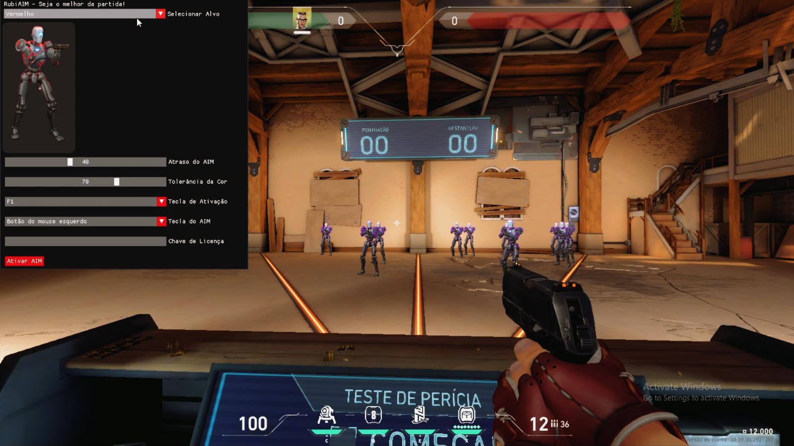

# VALORANT  
**AIM externo não detectado** cheat usando exploit recém-descoberto.  
Isso não vai mexer com os endereços e memórias do jogo, é 100% independente da memória.  
  
Personalizável através do menu.  
- A tecla de abertura é 'Insert', pressione-a para abrir o cheat.
  
 

[VIDEO TUTORIAL](https://youtu.be/VmpJ9y7YwN0?si=8ZMO4_oGPi63jUfI)
 
# INFO    
- Altere a tolerância se estiver puxando mal ou não.  
A tolerância padrão é 20 - 70 (Min - Max)       
Selecione uma 'Keybind' e adicione dentro do Valorant como uma tecla de atirar secundária.   
1) Nas configurações do jogo, encontre algo como Teclado ou Atalhos de teclado. 
2) Encontre a opção Disparar/Atirar:
    - por padrão a tecla principal é o botão esquerdo do mouse
    - o secundário não está atribuído (vincule-o a qualquer tecla, como 'P').
3) Volte ao software e adicione sua licença "VALORANT-RUBIAIM-USER04324-226822", após isso clique uma vez em ‘Ativar AIM’ e sua configuração será carregada.
